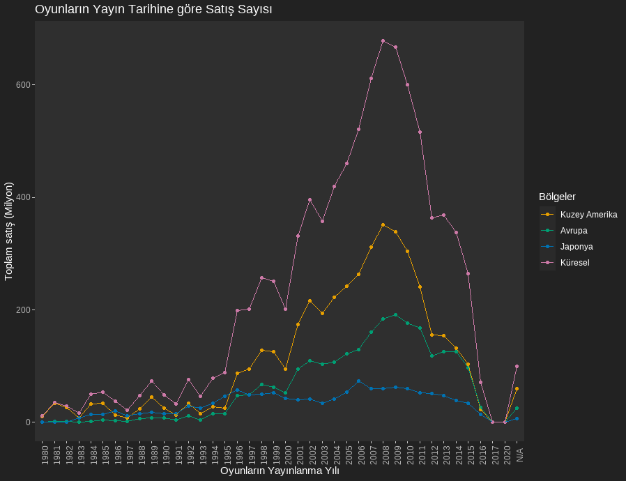
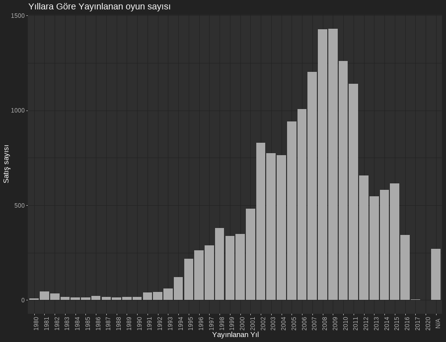
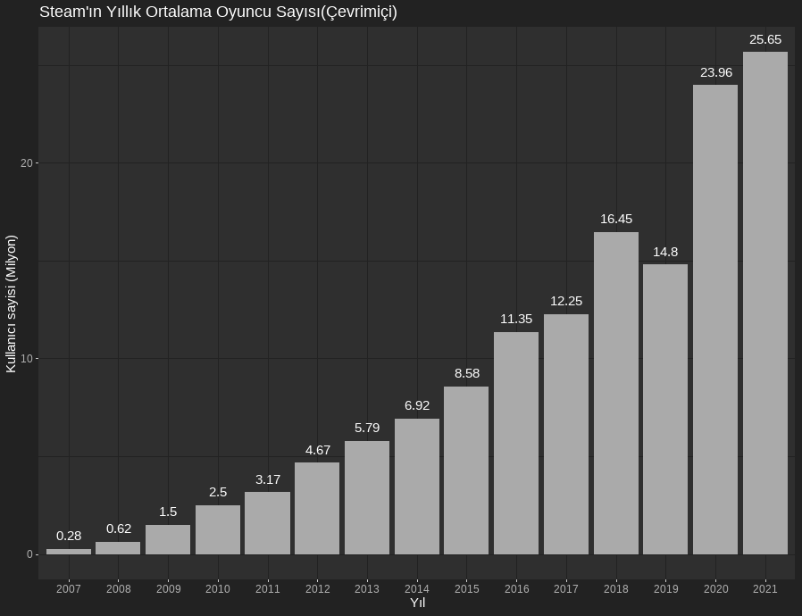
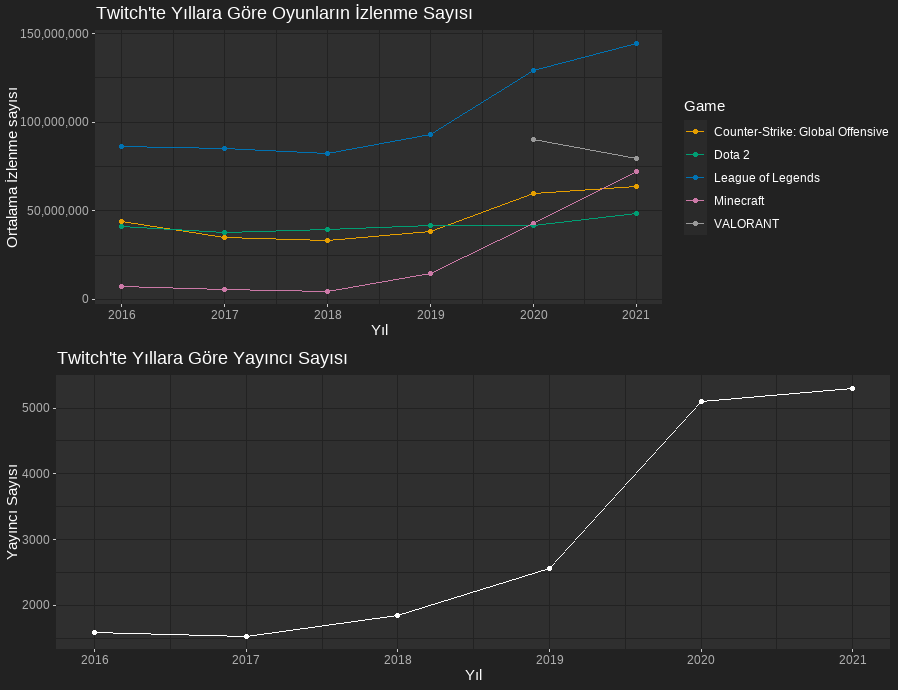

#Oyun Camiası Nereye Gidiyor Veri Görselleştirmesi

## ÖZET

Geçmişten günümüze kadar pek çok oyun geldi,geçti ve çıkıyor fakat oyun camiası nereye gidiyor?
Giderek büyüyen bir sektör mü yoksa gerileyen bir sektör mü ? Bu soruların cevabını bulmak için
hazırlanmış bir projedir. Bu projeyi hazırlarken Statix'in videyo oyunlar satış veri setini,
Steamın anlık oyuncu sayısı ve Twitch.tv'nin izlenme sayıları kullanılmıştır.

## Kullanılan veri setleri

*İlk olarak Video oyunları satış veri setine [buradan](https://www.kaggle.com/datasets/gregorut/videogamesales) ulaşabilirsiniz.
*Bu veri setinde video oyunlarının yıllara göre satış, tür, platform ve yayımcı firma gibi çok çeşitli ve kapsamlı bir veri setidir.

*İkinci olarak Steam'ın anlık oyuncu sayısını gösteren ve yıllara göre kategörize eden veri setine [buradan](https://backlinko.com/steam-users)
ulaşabilirsiniz.

*Üçüncü olarak ise canlı yayın platformu olan Twitch.tv'in yıllara göre izleyici ve yayıncı sayısını gösteren veri setine [buradan](https://www.kaggle.com/code/suvojithaldar/analyzing-top-games-and-categories-on-twitch-2016) ulaşabilirsiniz.

## Çalışmanın Amacı

*Bu çalışmanın amacı; Gitgide gelişen teklonoji ve yazılım dilleri sayesinde geliştirilen ve yayınlanan oyunların ne derece rağbet gördüğünü görselleştirmek.

*Giderek artan oyuncu ve oyun sayısının eğlenceden çok bir iş sektörü haline gelmesini açıklamak.

*İnsanların eğlenmek ve zaman geçirmek için gerçek hayat yerine sanal dünyayı tercih ettiğini göstermek.

##Kullanılan Program ve Paket Programlar.

*Bu çalışma yapılırken R programlama dili kullanılmış ve paket program olarak;

*ggplot2: Grafik oluşturmaya ve düzenlemeye yarar.

*tidyverse: Veri setinde çeşitli manipülasyonlar yaparak veriyi kullanışlı haline getirir.

*thematic: Oluşturulan grafiklerini temasını ve rengini belirlemeye yarar. Bu paket içerisinde showtext, ragg, bslib yer almaktadır.

*Dplyr: Veri işlemeyi ve veri analizi sürecini kolaylaştıran ve en çok kullanılan paketlerden birisidir.

*gridExtra: Grafikleri ayrı ayrı ve yan yana göstermeye yarar.

*reshape2: veri setindeki sütünları ve satırları düzenlemeye yarar.

## Oyunların Yatış Tarihine Göre Satış Fiyatı

*1980li yıllarda başlayan oyun furyası ilk satışını Kuzey Amerika bölgesinde yapmıştır. 
Daha sonra diğer ülkelere sıçrayan bu furya her yıl daha fazla satış yaparak PS3nin 
çıkışıyla 2008 yılında global olarak 850 milyon satış yaparak en yüksek değerine
ulaşmıştır ve çalışmada görüleceği üzere en çok satış yapan bölge ve en çok oyuncu
sayısına sahip bölge 387 milyon satışla Kuzey Amerika olmuştur.

## Yıllara Göre Yayınlanan Oyun Sayısı

*2008 yılından sonra oyun sayılarında düşüş yaşanıyor gibi gözüksede oyuncu sayısı art
arken toplam satış sayısının düşmesi yanlış bir yoruma sebebiyet verebilir. Aslında 20
08 yılında çok sayıda yeni oyun piyasaya sürüldüğü için satışlarda çok miktarda olmuşt
ur. İlerleyen yıllarda ise piyasaya çıkan yeni oyun sayısı azalmış ve 2008 ekonomik krizi
oyun camiasını da etkilemiştir bununla beraber oyuncular aynı oyunları daha yüksek sürelerde
oynamak zorunda kalmıştır.

## Steam'ın Yıllık Çevrimiçi Oyuncu sayısı

*Steam'ın 2007'den beri ortalama çevrimiçi oyuncu sayısını görmekteyiz. 2007 yılında Steam'ın ilk kurulduğu yılda 280 bin oyuncu çevrimiçiyken 2021 yılında bu sayı 26 milyon oyuncuya yaklaşmıştır. 2019 yılına kadar azalmadan artan oyuncu sayısı 2019 yılında şaşırtıcı bir biçimde azalmıştır ama hiç hız kaybetmeden 2020 yılında katlanarak artmaya devam etmiştir. Sonuç olarak oyun camiası hız kaybetmeden büyümeye devam ediyor ve her geçen gün yeni oyuncular bu camiaya katılıyor. Bununla beraber oyun programlama ve yazılım dünyasında iş olanakları artıyor ve gelişiyor.Ayrıca insanların zaman geçtikçe gerçek dünyadan çok sanal dünyada eğlenmeyi tercih ettiğini de söylenme imkanı doğuyor.

## Twitch.tv'nin İzleyici, Yayıncı ve En Çok İzlenen oyunları

*Oyun yayınları izlemek isteyenlerin ve oynadığı oyunları paylaşmak isteyenlerin
buluştuğu platform olan Twitch, yayıncıların bağış,reklam ve abonelikten para 
kazanmasıyla ortaya çıkmış yeni bir iş sektörüdür. Büyüyen oyun camiası ile birlikte
büyüyen Twitch.tv gerek e-spor yayınlarıyla gerek kişisel yayınlarla bu iş sektörünün
öncüsü olmuştur. Ayrıca en çok izlenen ve en çok yayıncı sayısına sahip olan oyunlar da 
görselleştirilmiştir. League of Legends(LoL) oyunu bu sektörde en çok büyüyen ve en
çok para kazandıran oyun haline gelmiştir(yıllık 147 milyon izlenme).Reklam verenlerin
ve sponsorların izlenme sayılarının büyüklüğünden dolayı en çok dikkatini çeken
twitch.tv başlıca bir reklam olup 7 den 70'e herkese iş verebilmektedir. Görüldüğü üzere
her oyun çıktıktan belli bir süre sonra az da olsa küçülme gözlemlenmiştir. Bu da 
oyuncuların oyunlara şans verip beğenmedikleri taktirde oyunları bıraktığını
göstermektedir. Her oyun herkese hitap etmediğinden dolayı oyun türü açısından
çeşitlilik sağlamıştır, bundan dolayı sanal dünyada geçirdiğimiz süre her saniye
artmaktadır.

## Sonuç ve Kaynakça

*Oyun camiası geçen her saniye büyümekte, oyuncu sayısı her saniye artmakta ve bununla beraber yeni iş olanakları ve iş sektörü ortaya çıkmaktadır.
İnsanların gerçek hayattan az da olsa kopabilmesini sağlayan oyun camiası bambaşka bir amaca evrilip çoğunluk için tamamen para kazanmaktan ibaret olmuştur.

*[Video Oyun Satışları için](https://www.kaggle.com/datasets/gregorut/videogamesales)
*[Twitch.tv izleyici ve yayıncı sayısı için](https://www.kaggle.com/code/suvojithaldar/analyzing-top-games-and-categories-on-twitch-2016)
*[Steam'ın çevrimiçi oyuncu sayısı için](https://backlinko.com/steam-users)
*[Oyun camiasının giderek büyüdüğünü gösteren bir haber kaynağı](https://www.aa.com.tr/tr/bilim-teknoloji/oyun-pazarinin-buyuklugu-2021de-176-milyar-dolar-oldu/2495852)
*[Video oyunlarının psikoloji üzerindeki etkisini araştıran bir proje](https://www.frontiersin.org/articles/10.3389/fpsyg.2019.01731/full)

Grafik Kodları İçin Buraya Tıklayınız.

